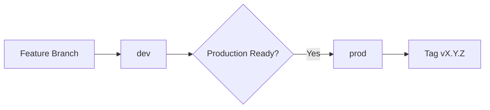

# **Git Flow** methodology

The workflow often called the **"Two-Stage Flow"** or **"Environment Branching"**. Here's how it aligns with common naming conventions and its official terminology:

---

### **Your Branching Strategy**

| Branch | Purpose             | Equivalent in Standard Flows |
| ------ | ------------------- | ---------------------------- |
| `dev`  | Ongoing development | `develop` in Git Flow        |
| `prod` | Production releases | `main`/`master` in Git Flow  |

---

### **Formal Name: Environment-Based Branching**

This is often referred to as **"GitLab Flow"** when combined with deployment pipelines, though your specific implementation is a simplified version. Key characteristics:

1. **Permanent Branches**:

   - `dev`: Integration branch for features
   - `prod`: Mirror of production code

2. **Temporary Branches**:
   - `feature/*`: For new functionality
   - `hotfix/*`: Critical production fixes

---

### **Full Development Workflow**



1. **Feature Development**:

   ```bash
   git checkout -b feature/new-product-form dev
   # Develop → Commit → Test
   git checkout dev
   git merge --no-ff feature/new-product-form
   git branch -d feature/new-product-form
   ```

2. **Production Release**:
   ```bash
   git checkout prod
   git merge --no-ff dev
   git tag -a v1.2.3 -m "Production release 1.2.3"
   git push origin prod --tags
   ```

---

### **Comparison to Popular Flows**

| Flow                | Your Model   | Git Flow         | GitHub Flow    |
| ------------------- | ------------ | ---------------- | -------------- |
| **Main Branches**   | dev/prod     | develop/main     | main           |
| **Release Cadence** | Manual merge | Release branches | Direct to main |
| **Hotfixes**        | From prod    | Hotfix branches  | From main      |

---

### **Best Practices for Your Flow**

1. **Branch Protection**:

   ```bash
   # Protect prod branch
   git config --add receive.denyDeleteBranch prod
   git config --add receive.denyNonFastForwards prod
   ```

2. **Semantic Versioning**:

   ```bash
   # Tagging example
   git tag -a v1.4.0 -m "Add product search feature"
   ```

3. **CI/CD Integration**:

   ```yaml
   # Sample GitHub Actions
   on:
     push:
       branches: [dev]
     pull_request:
       branches: [prod]
   ```

4. **Merge Strategies**:
   ```bash
   # Squash merge for features
   git merge --squash feature/awesome-new-thing
   ```

---

### **When to Use This Flow**

1. Web/mobile apps with distinct environments
2. Teams needing separation between WIP and production
3. Projects requiring manual approval before deployment
4. Legacy systems with formal release processes

This hybrid approach gives you the stability of Git Flow while maintaining the simplicity of GitHub Flow, making it ideal for Ionic/Angular mobile apps where production deployments need extra scrutiny.

CLI commands

ng generate interface models/Product

ng test --include=src/app/pages/home/home.page.spec.ts

ng test --include=src/app/pages/product-list/product-list.page.spec.ts
